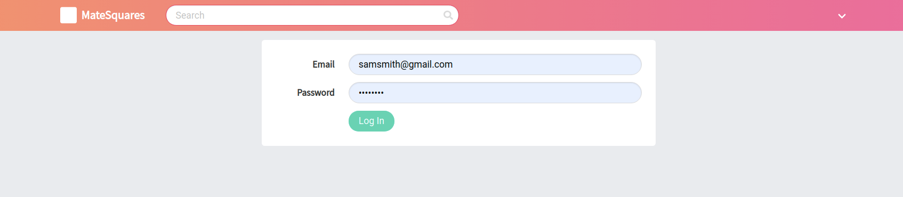

# Laravel Vue API Authentication

Simple web application uses laravel API authentication

### Screenshots





#### MINI DOCS

[https://github.com/SanjayPJ/laravel_mini_docs/blob/master/api_authentication.md](https://github.com/SanjayPJ/laravel_mini_docs/blob/master/api_authentication.md)


### Project Setup

```
npm install
```

```
npm run watch
```

```
cp .env.example .env
```

setup ENV FILE

```
php artisan key:generate
```

```
php artisan migrate
```
